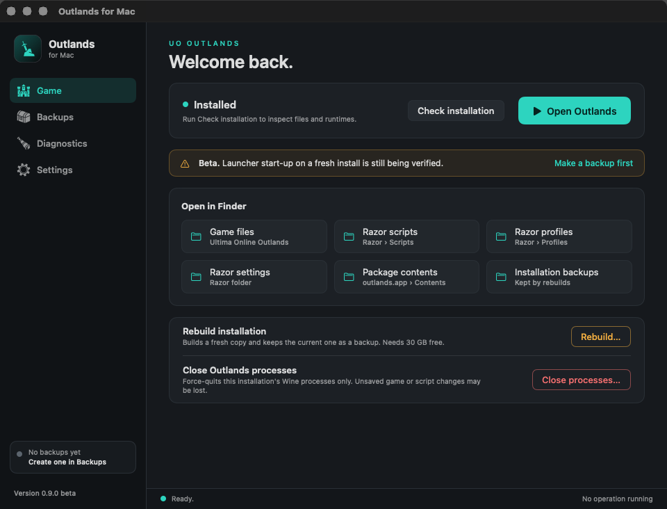

# UI and UX review plan

Review the application as a first-time Mac user and as an existing Outlands player protecting years of scripts and profiles. The target is a professional native interface with English copy, clear feedback and recoverable operations. Game artwork is limited to the teal app icon and sidebar navigation. Actions use custom flat button styles with one meaning per colour: teal primary, amber risky maintenance, red destructive. They keep their colour in inactive windows.

The screenshot documents the visual direction. It is one local screenshot, not evidence that every state works. Backup screenshots containing a real user's paths and catalog have deliberately not been added to this distributable review package. Inspect those flows with disposable data.

## Visual and interaction criteria

- Consistent spacing, type hierarchy, button sizes, alignment and primary/secondary/destructive treatment across all screens.
- Legible, correctly rendered app/sidebar vectors at normal and Retina scales; no missing resources when launched outside the source checkout.
- Standard native button feedback for hover, press, disabled and keyboard focus. Full sidebar row is clickable. Avoid gaming glyphs on every action.
- Minimum 940 by 700 content area, larger windows and scrolling: no clipped messages, overlapping buttons or inaccessible actions. Inspect the actual oldest supported OS as well as the current test Mac; native styles vary.
- Long paths, large font/accessibility settings, multiline errors, large catalogs and large process lists remain usable. Disclosure controls must communicate that details are available.
- Tab/Shift-Tab, Space/Return, Escape and VoiceOver work without mouse-only discovery. Status icons need meaningful spoken labels, not colour alone.
- Clear navigation and page context while an operation is running. Show immediate progress, prevent duplicate execution, and provide truthful cancellation/cleanup state.
- All app-owned text is English. OS-native dialogs and regional date/number formatting may follow system locale; verify whether that meets the intended product requirement.
- Appearance follows the system by default, with Light and Dark overrides in Settings. Evaluate both themes, increased contrast and reduced motion. Custom button styles need explicit checking of keyboard focus visibility.

## Screen and state matrix

All acceptance boxes below start unchecked. Local observations listed later do not automatically satisfy the full acceptance criteria.

| Scenario | What the reviewer must establish | Accepted |
| --- | --- | --- |
| Fresh launch, no game | Requirements, install action and Rosetta licence choice are clear. No missing-game dead end. | [ ] |
| Existing game | Open game, inspect folders and diagnostics are discoverable; rebuild does not look like a routine harmless refresh. | [ ] |
| Finder shortcuts | Open actual bundle Contents, game, Razor settings/scripts/profiles and installation-backup parent. Explain a missing path. | [ ] |
| Launcher start | Immediate feedback, useful asynchronous launch errors, no false success when Wine starts but launcher GUI does not. | [ ] |
| Installation running | Step, activity and elapsed time are coherent; actions disable appropriately while navigation remains usable. | [ ] |
| Cancellation | Explain stopping/cleanup, prevent double operations, preserve original game and allow a sensible retry. | [ ] |
| Failure and retry | Actionable error, no truncated text, log access and reviewed report; explain what was preserved and next action. | [ ] |
| Rebuild confirmation | Explicit preservation and disk requirements; Cancel is safe; verify concurrent-game warning. | [ ] |
| Backup empty state | Scope, external links, unencrypted local storage, destination selection and first-backup action are understandable. | [ ] |
| Backup creation | No overwrite, meaningful progress, cancel/panel-cancel behaviour, destination and completion feedback. | [ ] |
| Backup catalog | Dates, size, note persistence, verification date, missing/disconnected paths and multiple records remain readable. | [ ] |
| Backup verification | Clearly distinguish archive integrity, historical verification date and a guarantee that the restored game runs. | [ ] |
| Restore | Destination is separate; original remains intact; cancel and corrupt/incomplete package errors are understandable. | [ ] |
| Activate recovered copy | Explicit confirmation, existing installation preserved, insufficient space/incompatible legacy runtime explained. | [ ] |
| Diagnostics before first scan | Process state reads not checked, not zero. Explain which checks will and will not run. | [ ] |
| Diagnostics scanning | Filesystem/process work does not freeze interaction; progress and Stop work on large or slow volumes. | [ ] |
| Diagnostics results | Pass/warning labels distinguish runtime file checks from actual gameplay; large details collapse. | [ ] |
| Process shutdown | Clear unsaved-work and force-quit warning; no-process case, Cancel, failure and success; unrelated Wine unaffected. | [ ] |
| Report preview | Editable readable report, Cancel/Copy/Continue actions, no hidden upload; explain public draft and browser history. | [ ] |
| Export diagnostics | Cancel is harmless; redaction and sharing limitations clear; write errors and destination feedback useful. | [ ] |
| Settings and updates | Checking state, disabled duplicate check, no release, current/new release, offline/rate limit and disabled automatic checks. | [ ] |
| Closing or reopening app | Busy operation is not silently abandoned; idle close works; multiple windows do not create conflicting operations. | [ ] |
| Keyboard and VoiceOver | Logical tab order, visible focus, accessible status/progress/sheets and consistent dismissal. | [ ] |

## Suggested walkthroughs

1. In a disposable account with no installation, inspect onboarding and every reachable empty state. Cancel licence/install dialogs; do not accept terms merely to finish a UI inspection.
2. With a disposable installed wrapper, open each Finder shortcut. Run diagnostics, switch tabs, return, expand process details and inspect logs. Observe whether the global status message is confusing on another page.
3. Create a backup of a test wrapper with scripts, profiles, a Unicode filename and external symlink. Add a note, relaunch, verify, restore separately and compare contents. Corrupt a test copy and confirm a useful error without modifying the original archive.
4. Exercise shutdown on disposable Wine only, keeping a second unrelated wrapper running. Test confirmation cancellation and safe reporting of survivors.
5. Exercise a controlled installation failure and cancellation on an isolated test prefix. Review report contents; stop before submitting any issue or uploading a log.
6. Use keyboard and VoiceOver through all four pages, native file panels and the report sheet. Repeat on the supported OS floor and a small display. Record screenshots with synthetic paths/data only.

## Local observations and questions

The implementation assistant inspected Game, Backups, Diagnostics and Settings, the earlier report sheet, and Finder package contents. After the final control refinement, diagnostics completed on a real installation with 47 scoped processes, the process count appeared only after scanning, and details were collapsed. Standard action buttons had no game artwork. A later redesign added a first-launch requirements checklist, a step list during installation, a backup table with availability states, a global status bar and a theme setting; its screens were captured from the running app in Light and Dark appearance, with the installing state simulated. These are point observations, not a full accessibility or performance test.

Investigate the shared operation message across tabs, short error messages versus recovery instructions, destructive button prominence in inactive windows, progress for large archive scans, persistent error banners after successful actions, whether Stop can be repeatedly pressed, and whether an app-start request needs a visible pending state. Measure response rather than assuming that moving one task off the main thread fixes all stalls.

## Evidence to attach to the independent review

Capture one synthetic-data screenshot per page plus empty, busy, error, confirmation and report states. Record window size, display scale, macOS version and theme/accessibility settings. Attach concise keyboard/VoiceOver results and a short interaction recording if responsiveness is disputed. Do not include real backup names, account data, private profiles or report text in public evidence.

## Backup preview and settings recovery UI — 2026-10-04

Added a read-only backup preview (file/profile-file/script/macro counts, uncompressed data and links), per-file settings import review with search, All/None/New only selection, and explicit apply. Recovery preserves the previous complete ClassicUO directory for Undo, merges only selected regular files into a prepared copy, rejects redirected sources/destinations, checks source/current metadata again before promotion and keeps a bounded rename-recovery journal. The game assets and Wine engine remain outside the swapped directory. Preparation needs additional space for ClassicUO, not only the small settings archive. Old directories and interrupted staging are retained for inspection.

The catalog now has names, sorting, Refresh locations, and separate availability/last-integrity-check text. Game status separates an installation being found from passed local checks and unverified game startup. Operations expose phase messages, elapsed time and actionable completion; there is no fabricated percentage/ETA for unmeasured compression. Targeted recovery actions supplement error/report/dismiss controls. Focus outlines cover actions, tiles, links and sidebar buttons; Increase Contrast strengthens outlines. Page, preview and sheet keyboard shortcuts were added.

Normal suite: **53 tests total, 6 opt-in skips, 47 passed, 0 failures**, warnings as errors. Eight added tests cover preview counts, selective merge and Undo, stale source rejection, injected swap failure/rollback, cancellation/cleanup, redirected destinations/unrelated Undo, interrupted rename recovery and completed/unsafe journals. The tests use disposable folders only.

Bundled UI observed: revised Game status, catalog layout, read-only production settings preview (about 32.7 MB uncompressed; no backup created), and Escape cancellation. Command–2 navigation was observed after state refresh. Full Keyboard Access/VoiceOver, every recovery sheet interaction, minimum window/large text, oldest supported macOS and real power loss remain acceptance work. Core apply/Undo/recovery were executed only on fixtures; the owner's game was not modified or stopped. UI automation encountered repeated external state changes during an isolated archive-picker attempt; no production apply was performed.

## 2026-10-04: backup page horizontal overflow

Reproduced with the owner's available settings archive plus a missing full archive: the five-column Grid and action buttons expanded beyond a narrow window, clipping the sidebar and right-hand actions. The page now receives an explicit viewport width. Backup collection uses a compact stacked record layout when the complete table cannot fit; table actions are shared by both layouts. Backup information chips and page-header actions also have vertical fallbacks. Backup content and catalog records were not changed.

Bundled UI was visually verified at the minimum allowed window width (940 points), at 960 points and at a wider 1263-point window, using both available and missing records. All sidebar content, name/note fields and backup actions were visible; wider windows selected the table and smaller windows selected stacked records. No backup, restore, game launch or process termination was performed during this layout fix. Normal Swift suite: 55 tests, 6 skips, 0 failures; warnings as errors. Python tests (4), actionlint, whitespace checks, release build and extracted signature/self-check passed. Full VoiceOver and historical macOS acceptance remain unverified. Desktop shortcut targets this rebuilt local development app.
